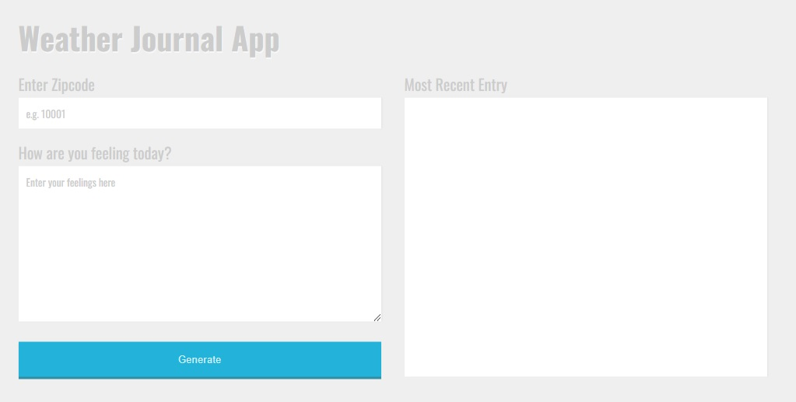

<h1 align="center">Weather-Journal App Project</h1>

## App Overview

This is a weather journal project for Udacity Front-end Developer course. When user enter zip code and current feeling, it will generate a weather journal. WeatherAPI will return current temperature, weather and city name of the zip code when you submit.

## Project Objective

Create an asynchronous web app that uses Web API and user data to dynamically update the UI in a Weather Journal application.

## Installation Guide

1. Clone directory or download the zip file.

2. Run the following command on terminal to download dependencies
   `npm install`

3. Run the following commend to open the server and start the app

`npm run start`
or
`node server.js`

4. Go to `localhost:3000` to use the app
